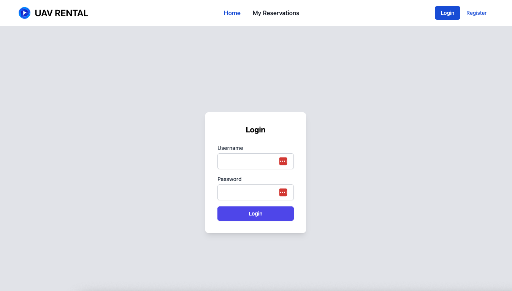

# Introduction

The goal of this project is users to rent UAVs on the project's website

### Main Features

- Users can register and login
- Users can rent UAVs
- Users can see their rental history and cancel their rentals
- Admin can add new UAVs
- Admin can see all the rentals
- Admin can see all the users
- Admin can see all the UAVs

### User Roles
- Staff ( no effect )
- Admin ( can see dashboard ). Admin can be created by the command `python manage.py createsuperuser`

### Technologies

- Python
- Django
- DRF
- PostgreSQL
- Docker
- Server-side table rendering with Datatables.net ( Using CDN )
- Server-side select rendering with Select2 ( Using CDN )
- Jquery ( Using CDN ) with Fetch and Ajax
- Tailwind CSS

### Installation

#### Using venv

- Clone the project
- run `python -m venv env`
- run `source env/bin/activate` or `env\Scripts\activate`
- Create .env file and add reference and fill in .env.example
- run `pip install -r requirements.txt`
- run `python manage.py migrate`
- run `python manage.py runserver`
- open `http://127.0.0.1:8000/` in your browser

#### Using Docker

- Clone the project
- Create .env file and add reference and fill in .env.example
- run `docker-compose up --build`
- open `http://127.0.0.1:8000/` in your browser

- if you want to run the project with venv, you can run the database using the original postgresql docker image and use
  it by entering database settings in the .env.